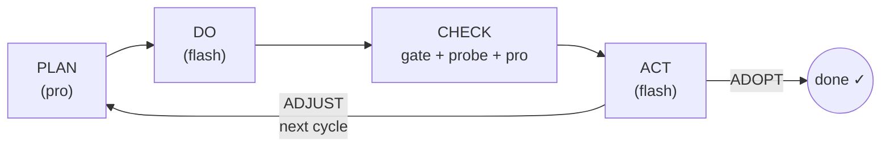

# PDCA AI

An autonomous coding agent that runs a **Plan → Do → Check → Act** loop on your machine, using DeepSeek models via the OpenAI-compatible API.

Give it a task in plain English. It writes code, runs tests, reads failures, fixes them, and keeps going until the task passes every objective gate.

---

## How it works



### The four phases

**PLAN** (`deepseek-v4-pro`)
Reasons about the current state of the working directory and the previous cycle's failures. Produces a JSON plan: analysis, strategy, concrete steps, success criteria, and shell verify commands.

**DO** (`deepseek-v4-flash`)
Receives the plan and writes a single Python script. The script runs on your machine in a subprocess using a sandboxed toolkit: `read()`, `write()`, `run()`, `ls()`, `note()`. Only its capped stdout (6000 chars) returns to the model — the script can produce arbitrary side effects (create files, run tests) but the model only sees what it prints. If the script crashes, a cheap in-cycle repair attempt runs before counting the cycle as failed.

**CHECK** (three layers, in order of authority)
1. **Objective gate**: the plan's `verify_commands` run as plain shell commands. Exit code is authoritative — a command that exits non-zero means the criterion is unmet, period.
2. **PROBE** (`deepseek-v4-pro`): an independent model writes its own verification script with fresh inputs under `.pdca_probe/`, runs the built artifact, and reports findings. Skipped when the gate already fails.
3. **Model audit** (`deepseek-v4-pro`): reviews all evidence and produces a structured `pass/fail` report. The gate overrules the model in both directions — if all verify commands exit 0, the task is adopted even if the model says fail.

**ACT** (`deepseek-v4-flash`)
Reads the check report. Can only say `ADOPT` (done) or `ADJUST` (continue). The harness enforces this in code: ADOPT is rejected if overall ≠ pass; ADJUST is overridden to ADOPT if overall = pass.

### Stopping conditions

The harness (never the model) decides when to stop:

| Condition | What happens |
|---|---|
| All verify commands exit 0 | Force ADOPT |
| Token budget exhausted (`--max-tokens`) | Stop, exit 2 |
| Wall-time limit (`--max-seconds`, default 30 min) | Stop, exit 2 |
| Cycle cap (`--max-cycles`) | Stop, exit 2 |
| Same failure 3× in a row | RETHINK: pro model takes Do, materially different strategy required |
| Same failure 5× in a row | Feasibility audit |
| 8 consecutive fail cycles (BACKSTOP) | Feasibility audit regardless of signature changes |
| Feasibility audit → INFEASIBLE | Stop, exit 1 (proven environmental impossibility) |

---

## Setup

**Requirements:** Python 3.10+, a DeepSeek API key.

```bash
git clone <repo>
cd pdca_ai
python -m venv .venv
source .venv/bin/activate       # Windows: .venv\Scripts\activate
pip install -e .
```

Create `.env` in the repo root:

```
DEEPSEEK_API_KEY=sk-...
```

Verify the environment:

```bash
PATH=$PWD/.venv/bin:$PATH pdca --help
```

---

## Usage

The `PATH` prefix is required so Do scripts and gate commands can find `pytest`, `ruff`, etc. from the venv.

### Single cycle (inspect mode)

Runs one full Plan → Do → Check → Act cycle and prints the check report. Does not loop.

```bash
PATH=$PWD/.venv/bin:$PATH pdca "your task" --workdir ./work_myfeature
```

### Loop mode

Cycles until ADOPT or a budget stop (tokens / time / cycles). The harness may also halt early if repeated identical failures trigger a feasibility audit that returns INFEASIBLE — this is a harness decision, not a model one.

```bash
PATH=$PWD/.venv/bin:$PATH pdca "your task" \
  --workdir ./work_myfeature \
  --loop
```

### Loop with a cycle cap

```bash
PATH=$PWD/.venv/bin:$PATH pdca "your task" \
  --workdir ./work_myfeature \
  --loop \
  --max-cycles 10
```

### All options

| Flag | Default | Description |
|---|---|---|
| `--loop` | off | Enable multi-cycle looping |
| `--workdir PATH` | `./work` | Directory where files are created/modified |
| `--max-cycles N` | 0 (unlimited) | Hard cycle cap; requires `--loop` to have effect beyond 1 |
| `--max-tokens N` | 400 000 | Total token budget across all cycles |
| `--max-seconds N` | 1800 | Wall-time limit in seconds |

---

## Writing a task

Tasks are plain-English descriptions of what the working directory should look like when done. Good tasks include:

- **What files** to create or modify
- **What the acceptance test is** (pytest, ruff, a specific command)
- **Concrete constraints** (function signatures, edge cases, output formats)

**Example — implement a module:**
```
Implement merge_intervals(intervals) in intervals.py where intervals is a list
of [start, end] pairs. Returns a sorted list of merged non-overlapping intervals;
touching intervals ([1,3] and [3,5]) merge to [1,5]. Write tests in
test_intervals.py. Must pass pytest and ruff check.
```

**Example — fix a bug:**
```
The function parse_date() in utils.py raises ValueError for dates in DD-MM-YYYY
format. Fix it to accept that format. All existing tests in test_utils.py must
still pass.
```

**Tips:**
- The plan's `verify_commands` must be plain shell commands (`pytest`, `ruff check .`, `python -c "..."`) — no `try/except` in `python -c` one-liners.
- If you want a specific output format (e.g. floats as strings), say so explicitly.
- The agent cannot ask clarifying questions — ambiguous tasks cost cycles.

---

## Project structure

```
pdca_ai/
├── pdca/
│   ├── cli.py        # typer CLI entry point
│   ├── config.py     # API key, model names, hard-stop defaults
│   ├── llm.py        # DeepSeek API wrapper (call + call_validated)
│   ├── toolkit.py    # read/write/run/ls/note — injected into Do scripts
│   ├── executor.py   # subprocess runner for Do scripts + syntax checker
│   ├── phases.py     # PLAN / DO / CHECK / ACT / PROBE / FEASIBILITY_AUDIT
│   ├── runner.py     # the while loop, stuck ladder, budgets, BACKSTOP
│   └── state.py      # STATE.md: appends each cycle, loads last-N digest
├── .env              # DEEPSEEK_API_KEY (not committed)
├── pyproject.toml
└── work_*/           # one directory per task run
    ├── STATE.md          # per-cycle history (objective, gate, check, act)
    ├── .pdca/            # harness artefacts (scripts, evidence logs)
    └── .pdca_probe/      # probe fixtures (created fresh each cycle)
```

### `STATE.md`

Each cycle appends a block to `STATE.md` in the workdir. This is the loop's memory — the last 2 blocks are fed back into the next Plan prompt. Inspect it to understand what the agent tried and why.

```
## Cycle 2 — 2026-06-12T03:21:00
Objective: ...
Strategy: ...
Gate: `pytest -q` -> 0; `ruff check .` -> 1
Check: overall=fail | unmet: ruff check fails (F401 unused import)
Act: ADJUST — remove unused import pytest from test_intervals.py
```

### `.pdca/` artefacts

| File | Contents |
|---|---|
| `cycle_N_script.txt` | The Python script the Do model wrote for cycle N |
| `evidence_cycle_N.log` | `note()` calls from the Do script |
| `probe_N_script.txt` | The verification script the Probe model wrote |
| `cycle_N_stderr.txt` | stderr from the Do script (if any) |

---

## Model routing

| Phase | Model | Reason |
|---|---|---|
| Plan | `deepseek-v4-pro` | Needs deep reasoning about failures |
| Do | `deepseek-v4-flash` | Speed; writes code, not strategy |
| Do (stuck ≥3×) | `deepseek-v4-pro` | RETHINK mode: materially different approach |
| Probe | `deepseek-v4-pro` | Independent skeptical review |
| Check | `deepseek-v4-pro` | Auditor needs to reason about edge cases |
| Act | `deepseek-v4-flash` | Binary decision; report already made |
| Feasibility audit | `deepseek-v4-pro` | High-stakes stop decision |

---

## Token costs (observed)

| Task | Cycles | Tokens |
|---|---|---|
| Stats module (mean/median/std_dev/percentile + 24 tests) | 1 | ~22 000 |
| LRU cache + 6 tests | 1 | ~23 000 |
| FizzBuzz + 8 tests | 1 | ~17 000 |
| Interval merge + 10 tests | 2 | ~30 000 |
| Impossible task (unwritable dir) | 8 (→ INFEASIBLE) | ~194 000 |

Typical well-specified tasks: **1–2 cycles, 20–35k tokens**. Stuck tasks burn ~20–25k tokens per cycle before the stuck ladder escalates.

---

## Exit codes

| Code | Meaning |
|---|---|
| 0 | ADOPTED — task complete |
| 1 | STOPPED — proven infeasible |
| 2 | STOPPED — budget (tokens / time / cycles) |
| 3 | Environment error — `pytest` or `ruff` not found in PATH |
