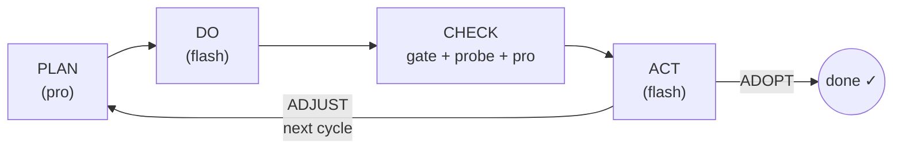

# PDCA AI

An autonomous coding agent that runs a **Plan → Do → Check → Act** loop on your machine, using DeepSeek models via the OpenAI-compatible API.

Give it a task in plain English. It writes code, runs tests, reads failures, fixes them, and keeps going until the task passes every objective gate.

The toolkit works across your whole machine: Do/Probe scripts can read, write, and run commands [anywhere](#working-anywhere-on-the-machine), not just inside the working directory. Every run is recorded to a [session log](#session-logs), tasks can be [scheduled](#scheduling) to run on a recurring basis, and a run can email you a [status report](#notifications) when it finishes.

---

## How it works



### The four phases

**PLAN** (`deepseek-v4-pro`)
Reasons about the current state of the working directory and the previous cycle's failures. Produces a JSON plan: analysis, strategy, concrete steps, success criteria, and shell verify commands.

**DO** (`deepseek-v4-flash`)
Receives the plan and writes a single Python script. The script runs on your machine in a subprocess using a toolkit: `read()`, `write()`, `run()`, `ls()`, `note()`. Only its capped stdout (6000 chars) returns to the model — the script can produce arbitrary side effects (create files, run tests) but the model only sees what it prints. If the script crashes, a cheap in-cycle repair attempt runs before counting the cycle as failed.

**CHECK** (three layers, in order of authority)
1. **Objective gate**: the plan's `verify_commands` run as plain shell commands. Exit code is authoritative — a command that exits non-zero means the criterion is unmet, period.
2. **PROBE** (`deepseek-v4-pro`): an independent model writes its own verification script with fresh inputs under `.pdca_probe/`, runs the built artifact, and reports findings. Skipped when the gate already fails.
3. **Model audit** (`deepseek-v4-pro`): reviews all evidence and produces a structured `pass/fail` report. The gate overrules the model in both directions — if all verify commands exit 0, the task is adopted even if the model says fail.

**ACT** (`deepseek-v4-flash`)
Reads the check report. Can only say `ADOPT` (done) or `ADJUST` (continue). The harness enforces this in code: ADOPT is rejected if overall ≠ pass; ADJUST is overridden to ADOPT if overall = pass.

### Stopping conditions

The harness (never the model) decides when to stop:

| Condition | What happens |
|---|---|
| All verify commands exit 0 | Force ADOPT |
| Token budget exhausted (`--max-tokens`) | Stop, exit 2 |
| Wall-time limit (`--max-seconds`, default 30 min) | Stop, exit 2 |
| Cycle cap (`--max-cycles`) | Stop, exit 2 |
| Same failure 3× in a row | RETHINK: pro model takes Do, materially different strategy required |
| Same failure 5× in a row | Feasibility audit |
| 8 consecutive fail cycles (BACKSTOP) | Feasibility audit regardless of signature changes |
| Feasibility audit → INFEASIBLE | Stop, exit 1 (proven environmental impossibility) |

---

## Setup

**Requirements:** Python 3.10+, a DeepSeek API key.

```bash
git clone <repo>
cd pdca_ai
python -m venv .venv
source .venv/bin/activate       # Windows: .venv\Scripts\activate
pip install -e .
```

Create `.env` in the repo root:

```
DEEPSEEK_API_KEY=sk-...
RESEND_API_KEY=re_...        # optional — only needed for email notifications
```

`RESEND_API_KEY` is optional: it is only read when you opt into email
[notifications](#notifications). If it is absent, notify simply no-ops — a missing
key never blocks or fails a run.

Verify the environment:

```bash
PATH=$PWD/.venv/bin:$PATH pdca --help
```

---

## Usage

The `PATH` prefix is required so Do scripts and gate commands can find `pytest`, `ruff`, etc. from the venv.

`pdca "<task>" …` is shorthand for the `run` subcommand — `pdca run "<task>" …` is
the explicit form (use it if your task text happens to start with `run` or
`schedule`). The sibling command group is [`schedule`](#scheduling).

### Single cycle (inspect mode)

Runs one full Plan → Do → Check → Act cycle and prints the check report. Does not loop.

```bash
PATH=$PWD/.venv/bin:$PATH pdca "your task" --workdir ./work_myfeature
```

### Loop mode

Cycles until ADOPT or a budget stop (tokens / time / cycles). The harness may also halt early if repeated identical failures trigger a feasibility audit that returns INFEASIBLE — this is a harness decision, not a model one.

```bash
PATH=$PWD/.venv/bin:$PATH pdca "your task" \
  --workdir ./work_myfeature \
  --loop
```

### Loop with a cycle cap

```bash
PATH=$PWD/.venv/bin:$PATH pdca "your task" \
  --workdir ./work_myfeature \
  --loop \
  --max-cycles 10
```

### All options

| Flag | Default | Description |
|---|---|---|
| `--loop` | off | Enable multi-cycle looping |
| `--workdir PATH` | `./work` | Directory where files are created/modified |
| `--max-cycles N` | 0 (unlimited) | Hard cycle cap; requires `--loop` to have effect beyond 1 |
| `--max-tokens N` | 400 000 | Total token budget across all cycles |
| `--max-seconds N` | 1800 | Wall-time limit in seconds |
| `--notify` | off | Email a status report when the run finishes (requires `--notify-to`) |
| `--notify-to EMAIL` | — | Recipient address for `--notify` (required when `--notify` is set) |

---

## Writing a task

Tasks are plain-English descriptions of what the working directory should look like when done. Good tasks include:

- **What files** to create or modify
- **What the acceptance test is** (pytest, ruff, a specific command)
- **Concrete constraints** (function signatures, edge cases, output formats)

**Example — implement a module:**
```
Implement merge_intervals(intervals) in intervals.py where intervals is a list
of [start, end] pairs. Returns a sorted list of merged non-overlapping intervals;
touching intervals ([1,3] and [3,5]) merge to [1,5]. Write tests in
test_intervals.py. Must pass pytest and ruff check.
```

**Example — fix a bug:**
```
The function parse_date() in utils.py raises ValueError for dates in DD-MM-YYYY
format. Fix it to accept that format. All existing tests in test_utils.py must
still pass.
```

**Tips:**
- The plan's `verify_commands` must be plain shell commands (`pytest`, `ruff check .`, `python -c "..."`) — no `try/except` in `python -c` one-liners.
- If you want a specific output format (e.g. floats as strings), say so explicitly.
- The agent cannot ask clarifying questions — ambiguous tasks cost cycles.

---

## Project structure

```
pdca_ai/
├── pdca/
│   ├── cli.py            # typer CLI: `run` + `schedule` group + argv shim (entry)
│   ├── config.py         # API keys, model names, hard-stop defaults, UNRESTRICTED, notify sender
│   ├── llm.py            # DeepSeek API wrapper (call + call_validated); logs every call
│   ├── core/             # the PDCA engine
│   │   ├── runner.py     # the while loop, stuck ladder, budgets, BACKSTOP
│   │   ├── phases.py     # PLAN / DO / CHECK / ACT / PROBE / FEASIBILITY_AUDIT
│   │   ├── session.py    # per-run session dir (session.log, raw/, scripts/, meta.json)
│   │   └── state.py      # STATE.md: appends each cycle, loads last-N digest
│   ├── execution/
│   │   └── executor.py   # subprocess runner for Do scripts + syntax checker
│   ├── scheduling/
│   │   └── scheduler.py  # schedules.json + crontab management (python-crontab)
│   └── tools/            # the tools the agent has access to
│       ├── toolkit.py    # read/write/run/ls/note — injected into Do scripts
│       └── notify/       # the ONLY external-notification mechanism (Resend email)
│           ├── notify.py    # orchestration: build facts → compose → render → send
│           ├── composer.py  # LLM writes the subject + summary
│           ├── template.py  # HTML template + code-filled deterministic facts
│           └── sender.py    # Resend delivery wrapper (api key from env/config)
├── .env                  # DEEPSEEK_API_KEY, optional RESEND_API_KEY (not committed)
├── pyproject.toml
└── work_*/           # one directory per task run
    ├── STATE.md          # per-cycle history (objective, gate, check, act)
    ├── .pdca/            # harness artefacts (scripts, evidence logs)
    └── .pdca_probe/      # probe fixtures (created fresh each cycle)

~/.pdca_agent/            # global agent state (outside the repo)
├── sessions/             # one dir per invocation — the source of truth (see below)
├── schedules.json        # stored scheduled jobs
├── cron/<name>.log       # per-job cron bootstrap logs
└── work/<name>/          # default workdir for a scheduled job
```

### `STATE.md`

Each cycle appends a block to `STATE.md` in the workdir. This is the loop's memory — the last 2 blocks are fed back into the next Plan prompt. Inspect it to understand what the agent tried and why.

```
## Cycle 2 — 2026-06-12T03:21:00
Objective: ...
Strategy: ...
Gate: `pytest -q` -> 0; `ruff check .` -> 1
Check: overall=fail | unmet: ruff check fails (F401 unused import)
Act: ADJUST — remove unused import pytest from test_intervals.py
```

### `.pdca/` artefacts

| File | Contents |
|---|---|
| `cycle_N_script.txt` | The Python script the Do model wrote for cycle N |
| `evidence_cycle_N.log` | `note()` calls from the Do script |
| `probe_N_script.txt` | The verification script the Probe model wrote |
| `cycle_N_stderr.txt` | stderr from the Do script (if any) |

---

## Working anywhere on the machine

The toolkit is not limited to the working directory. In `read()`, `write()`, `run()`, and `ls()`:

- **relative paths** resolve against `--workdir` (e.g. `write("app.py", …)`);
- **absolute paths** are used as given (e.g. `write("/tmp/out.txt", …)`, `read("/etc/hosts")`);
- `run()` executes any shell command.

So a task can create or edit files outside the workdir directly. Each run prints a one-line `UNRESTRICTED MODE` banner at startup so you can see it is active.

**Example — write a file outside the workdir:**

```bash
PATH=$PWD/.venv/bin:$PATH pdca \
  "Create the file /tmp/pdca_test.txt containing today's date." \
  --workdir ./work_scratch --loop
```

To keep the toolkit confined to the working directory instead (relative paths only), set `UNRESTRICTED = False` in `pdca/config.py`.

---

## Session logs

Every invocation (manual **or** scheduled) opens one session directory and routes
all logging through it, alongside (never replacing) the console output:

```
~/.pdca_agent/sessions/run_session_<YYYY-MM-DD>_<HH-MM-SS>_<8hex>/
├── session.log   # timeline: phase entered, model, decision, cycle, timestamps
├── raw/          # one JSON per model call — exact prompt + raw completion
│   └── <cycle>_<phase>_<seq>.json   # e.g. 1_PLAN_1.json, 1_DO_2.json (repair)
├── scripts/      # every Do/Probe script as executed
│   └── cycle1_DO_attempt1.py, cycle1_PROBE.py, ...
└── meta.json     # task, workdir, trigger, start/end, outcome, exit_code, tokens, cycles
```

Each `raw/` file holds `{prompt:{system,user}, completion, model, tokens, latency_s, ...}`
verbatim for PLAN/DO/CHECK/PROBE/ACT and every retry — nothing the model said is
discarded. `meta.json`'s `trigger` is `"manual"` for a direct run or
`"scheduled:<name>"` for a cron-launched one, so the two are easy to tell apart.

**Inspect the most recent run:**

```bash
SESS=$(ls -dt ~/.pdca_agent/sessions/*/ | head -1)
cat "$SESS/meta.json"          # outcome, tokens, cycles, trigger
cat "$SESS/session.log"        # full timeline
ls  "$SESS/raw"                # every prompt + completion, one file per call
```

---

## Notifications

`tools/notify/` is the agent's **only** external-notification channel. When enabled,
it sends a single status email when a run finishes — manual or scheduled. It is
**opt-in** and off by default: nothing leaves your machine unless you ask for it.

Enable it per run with two flags — `--notify` to turn it on and `--notify-to` for
the recipient (required):

```bash
PATH=$PWD/.venv/bin:$PATH pdca "your task" \
  --workdir ./work_myfeature --loop \
  --notify --notify-to you@example.com
```

`--notify` without `--notify-to` is rejected before any work starts (exit 2).

### What you get

The email reports the run's outcome with deterministic facts filled by the harness
(never the model): outcome, exit code, cycles, tokens, duration, trigger, workdir,
and session id. Only the **subject** and a short 2–4 sentence **summary** are written
by the model (`deepseek-v4-flash`), with a deterministic fallback so the email still
sends if composition fails. The model never sees or pastes raw logs.

Notification is non-fatal by design: any delivery error is logged to the session log
and swallowed, so it can **never** change a run's exit code.

### Backend & configuration

Delivery uses [Resend](https://resend.com). The API key is read from the
environment / `.env` (`RESEND_API_KEY`) and is never hardcoded. Two settings control
the sender (recipient is always supplied per run via `--notify-to`):

| Env var | Default | Purpose |
|---|---|---|
| `RESEND_API_KEY` | — | Resend API key; if unset, notify no-ops |
| `PDCA_NOTIFY_FROM` | `agent_pdca@resend.dev` | Sender identity (Resend's shared, pre-verified test domain) |

### Scheduled runs

`pdca schedule add` takes the same `--notify` / `--notify-to` flags; the recipient is
stored per job, and each cron wake-up emails it when that run finishes. Jobs added
without `--notify` stay silent. `schedule list` shows each job's `notify:` recipient
(or `off`).

```bash
pdca schedule add "<your task>" --every "daily" --name nightly-build \
  --notify --notify-to you@example.com
```

---

## Scheduling

The PDCA loop runs to a stop and exits — it is not a daemon. **Scheduling does not
make the loop recurring.** Each cron wake-up launches a *fresh, complete* `pdca`
run with a stored prompt: one wake-up = one full session dir.

```bash
# install a job (idempotent: re-adding the same --name replaces its crontab line)
pdca schedule add "append the current timestamp to ~/pdca_heartbeat.log" \
  --every "5m" --name heartbeat            # [--workdir PATH] optional

pdca schedule list                 # name, schedule, prompt, workdir, last run, cron✓/✗
pdca schedule run heartbeat        # run once now (no waiting for cron) — for testing
pdca schedule remove heartbeat     # remove the crontab line + the stored job
```

### Choosing a schedule

`--every` takes a shorthand or a raw 5-field cron expression:

| `--every` | Runs | Cron equivalent |
|---|---|---|
| `5m` | every 5 minutes | `*/5 * * * *` |
| `15m` | every 15 minutes | `*/15 * * * *` |
| `30m` | every 30 minutes | `*/30 * * * *` |
| `2h` | every 2 hours | `0 */2 * * *` |
| `hourly` | top of every hour | `0 * * * *` |
| `daily` | every day at midnight | `0 0 * * *` |
| `weekly` | every Sunday at midnight | `0 0 * * 0` |
| `monthly` | the 1st of each month, midnight | `0 0 1 * *` |
| `"0 9 * * *"` | every day at 09:00 | *(raw cron)* |
| `"30 18 * * 5"` | every Friday at 18:30 | *(raw cron)* |

`Nm` accepts 1–59 and `Nh` accepts 1–23; for a specific time of day or weekday,
pass a raw cron expression (`minute hour day-of-month month day-of-week`).

```bash
# every 10 minutes
pdca schedule add "<your task>" --every "10m" --name watcher

# every hour, on the hour
pdca schedule add "<your task>" --every "hourly" --name hourly-sync

# every day (at midnight)
pdca schedule add "<your task>" --every "daily" --name nightly-build

# every day at 9:00am  (raw cron — finer control than the shorthands)
pdca schedule add "<your task>" --every "0 9 * * *" --name morning-report

# every Monday at 8:00am
pdca schedule add "<your task>" --every "0 8 * * 1" --name weekly-digest
```

Jobs live in `~/.pdca_agent/schedules.json`; each
installs **one** crontab line tagged `# pdca:<name>`, so adds never duplicate and
unrelated crontab lines are never touched. The line uses the absolute venv `pdca`,
puts the venv on `PATH`, `cd`s into the workdir, and redirects its bootstrap output
to `~/.pdca_agent/cron/<name>.log` (separate from session logs). Cron calls the
hidden `pdca _run-scheduled <name>` entrypoint. If `--workdir` is omitted, the job
defaults to `~/.pdca_agent/work/<name>`.

---

## Model routing

| Phase | Model | Reason |
|---|---|---|
| Plan | `deepseek-v4-pro` | Needs deep reasoning about failures |
| Do | `deepseek-v4-flash` | Speed; writes code, not strategy |
| Do (stuck ≥3×) | `deepseek-v4-pro` | RETHINK mode: materially different approach |
| Probe | `deepseek-v4-pro` | Independent skeptical review |
| Check | `deepseek-v4-pro` | Auditor needs to reason about edge cases |
| Act | `deepseek-v4-flash` | Binary decision; report already made |
| Feasibility audit | `deepseek-v4-pro` | High-stakes stop decision |

---

## Token costs (observed)

| Task | Cycles | Tokens |
|---|---|---|
| Stats module (mean/median/std_dev/percentile + 24 tests) | 1 | ~22 000 |
| LRU cache + 6 tests | 1 | ~23 000 |
| FizzBuzz + 8 tests | 1 | ~17 000 |
| Interval merge + 10 tests | 2 | ~30 000 |
| Impossible task (unwritable dir) | 8 (→ INFEASIBLE) | ~194 000 |

Typical well-specified tasks: **1–2 cycles, 20–35k tokens**. Stuck tasks burn ~20–25k tokens per cycle before the stuck ladder escalates.

---

## Exit codes

| Code | Meaning |
|---|---|
| 0 | ADOPTED — task complete |
| 1 | STOPPED — proven infeasible |
| 2 | STOPPED — budget (tokens / time / cycles) |
| 3 | Environment error — `pytest` or `ruff` not found in PATH |
| 4 | No such scheduled job (`pdca schedule run`/`_run-scheduled` with unknown name) |
